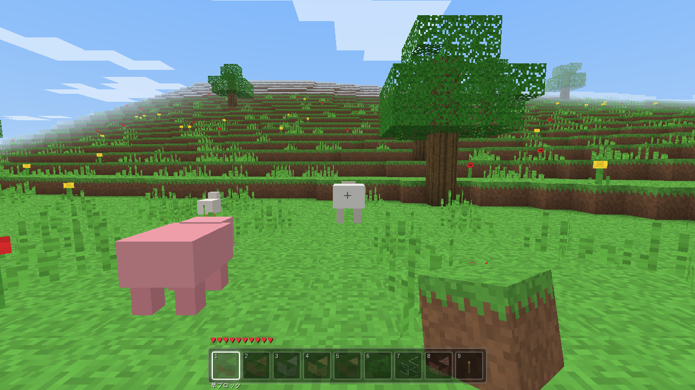

# ⛏ MineCraft.js — ブラウザで動くボクセルサンドボックス

外部ライブラリ・外部アセットを一切使わず、素の JavaScript + WebGL だけで実装した
Minecraft 風サンドボックスゲームです。テクスチャも効果音もすべて実行時に
プロシージャル生成しています。

**このゲームの目標**: **エンダードラゴンの討伐**。エンダーパールを集めて
エンダーアイを作り、ストロングホールドのエンドポータルを起動して
「ジ・エンド」へ渡り、黒曜石の柱に守られたドラゴンを倒すのが最終目標です。



## 🐉 最終目標: エンダードラゴン討伐

1. **エンダーマン** (夜にまれに出現するニュートラルなモブ) を殴って倒すと
   **エンダーパール**をドロップする
2. **エンダーパール + 火薬** (クリーパーのドロップ) でクラフト台から
   **エンダーアイ**を作る
3. エンダーアイを (フレーム以外に向かって) 使うと, 1 個消費して
   **ストロングホールドの方角と距離**がトーストで表示される。実際に紫色に
   輝きながらその方角へ飛んでいく様子も見える。それを頼りに地下を掘り進めて
   **エンドポータルの間** を見つけ出す。部屋の中央には本家同様,
   溶岩の堀に囲まれた石レンガの高台があり, その上にポータルの枠が乗っている
   (南側の橋と階段から上がれる)
4. 高台の 12 個の **エンドポータルフレーム** に向かってエンダーアイを
   使うとはめ込まれる。すべて埋まると中央のポータルが起動する
5. ポータルに乗ると **「ジ・エンド」** (通常の地形とは全く別の, 太い黒曜石の柱
   10 本に囲まれた大きなエンドストーンの本島。周りは奈落) へ渡る。
   エンドストーンの上には**エンダーマン**が徘徊している
6. 柱の上の **エンダークリスタル** が生きている間は **エンダードラゴン** の
   体力が回復し続けるので, 先に剣や弓でクリスタルを壊してから
   ドラゴン本体を剣・弓で攻撃する。特に高い 2 本の柱のクリスタルは
   鉄格子風の檻に守られている。クリスタルは壊すと爆発し, 近くにいると
   爆風ダメージを受ける。ドラゴンは周回飛行しつつ, 時々プレイヤーへ
   急降下して体当たり攻撃をしてくるほか, 中央の泉に降りて羽を休める
   (本家のパーチ行動 — 攻撃のチャンス!)。戦闘中は画面上部に
   **ボス HP バー**が表示され, 残り体力がひと目で分かる (ウィザー戦も同様)
7. ドラゴンを倒すと中央の**岩盤の泉**にポータルが点火され, 頂上に
   **ドラゴンの卵** (討伐の記念トロフィー, 回収可能) が出現する。
   ポータルに乗るとオーバーワールドの元の場所へ帰還できる。
   撃破は記録され, 再訪してもドラゴンは再出現しない

**外周の浮島群**: 本島から奈落を挟んだ先 (170〜440 ブロック) には
エンドストーンの浮島群が広がっており, 紫の**コーラスツリー**が生え,
ところどころに**エンドシティ** (プルパーブロックの塔) が立っている。
塔の最上階の宝箱にはダイヤ・エンダーパール・金などが眠っている。
コーラスフラワー 1 個からプルパーブロック 4 個をクラフトできる。

奈落に落ちてしまってもオーバーワールドへ強制送還されるだけなので,
死ぬ心配はありません (ただしダメージは受けます)。

## 🔥 ネザー

黒曜石で幅 2-4 x 高さ 3-5 の長方形の枠を組み, **火打ち石と鉄**
(鉄インゴット + 火打ち石。火打ち石は砂利を掘ると 12% の確率でドロップ) で
枠の内側に向かって使うとネザーポータルが起動する。乗るとオーバーワールドの
座標を 1/8 に縮めた場所にある「ネザー」(岩盤に挟まれた, ネザーラックを
洞窟状にくり抜いた世界) へ渡る。低い場所は溶岩の海になっており, 触れると
燃え続けるので要注意。本家のように全体の明るさが底上げされているので,
松明が無い場所でも周囲がしっかり見える。地形は本家風に作り込まれている:
天井のあちこちから**グロウストーンの塊**がシャンデリアのように垂れ下がり,
高い天井からは**溶岩滝**が流れ落ちる。溶岩の海の岸辺や海底には
**マグマブロック** (上に立つとダメージ。スニークで回避, 本家準拠) が敷かれ,
低地には**ソウルサンドの谷**が広がる。壁の中には隠れ溶岩だまりがあり,
掘り当てると噴き出してくる。**ネザー水晶鉱石**を掘って集めれば, クォーツブロックの
材料になる。**ゾンビピッグマン** (ニュートラル)・空を飛ぶ **ブレイズ**
(遠距離攻撃)・黒い **ウィザースケルトン** (強力な近接攻撃)・巨大な
**ギャスト** (浮遊してファイアボールを放つ) が徘徊しており, 倒すと
それぞれ金インゴット・ブレイズロッド・石炭・火薬をドロップする。
固定座標には **ネザーフォートレス** (ネザーレンガの十字型の橋) があり,
中央の宝箱には初めて近づいたときにネザー水晶・金・火薬などが詰まっている。
ソウルサンドの上は歩くのが遅くなり, ベッドで眠ろうとすると爆発するので注意。
ポータルに再度乗ればオーバーワールドの元の場所へ戻れる。

## 💀 隠しボス: ウィザー

ウィザースケルトンを倒すとまれに**頭蓋骨**をドロップする。ソウルサンド 4 個を
T字 (縦棒 1 個 + その上に横棒 3 個) に組み, 一番上の横棒 3 マスに頭蓋骨を
はめ込むと**ウィザー**が召喚される (最後の頭蓋骨を置いた瞬間に爆発が起こる)。
体力 150 で宙に浮いて飛び回り, 距離を保ちながら黒いウィザースカルを撃ってくる
強敵で, 時間経過でゆっくり体力が回復するので一気に畳みかける必要がある。
倒すと**ネザースター** (光るトロフィーブロック) をドロップする。

## 🧭 その他の便利アイテム

**コンパス** (鉄インゴット x4) を使うとスポーン地点 (ベッドがあればそこ) の
方角と距離がトーストで表示される (消費しない)。

## 遊び方

`index.html` をブラウザで開くだけで動きます。ローカルサーバー経由でも OK:

```bash
npx serve .        # または python3 -m http.server
```

GitHub Pages にデプロイすればそのまま公開できます
(リポジトリ設定 → Pages → ブランチを選ぶだけ)。

## 操作方法

| キー | 動作 |
|---|---|
| W A S D | 移動 |
| マウス | 視点操作 |
| Space | ジャンプ / (飛行中) 上昇 |
| Shift | スニーク (減速・端から落ちない) / (飛行中) 下降 |
| Ctrl | ダッシュ |
| F または Space 2 回 | 飛行モード切替 |
| 左クリック | ブロック破壊 (長押しで連続) |
| 右クリック | ブロック設置 (長押しで連続) |
| 1–9 / マウスホイール | ブロック選択 |
| ミドルクリック | ピックブロック (見ているブロックを手に持つ) |
| E | インベントリ (全ブロックから選択 / サバイバルではクラフトも) |
| G | サバイバル / クリエイティブ切替 (ポーズ画面のボタンでも可) |
| M | BGM オン / オフ (生成音楽) |
| P | スクリーンショットを PNG 保存 |
| F3 | デバッグ情報 (FPS / 座標 / バイオームなど) |
| N | 新しいワールドを生成 (シード値の指定も可能) |
| Esc | ポーズ |

ワールドへの変更 (設置 / 破壊) は自動的に `localStorage` へ保存され、
リロードしても復元されます。

### タッチ操作 (スマートフォン / タブレット)

スマホでは**横画面・全画面**でプレイします。プレイ開始時に自動で全画面化と
横向きロックを試み (Android Chrome 等)、非対応の端末 (iOS Safari 等) では
縦向きのときに回転を促す案内が表示されます。ノッチのある端末では
セーフエリアを避けて UI を配置します。

| 操作 | 動作 |
|---|---|
| 左下のジョイスティック | 移動 (前いっぱいに倒すとダッシュ) |
| 画面をドラッグ | 視点操作 |
| タップ | ブロック設置 |
| 長押し | ブロック破壊 (押している間連続) |
| 🎒 ボタン | インベントリ / クラフトを開く |
| ⬆ ボタン | ジャンプ / (飛行中) 上昇 |
| ✈ ボタン | 飛行モード切替 (飛行中は ⬇ で下降) |
| ⏸ ボタン | ポーズ |
| ポーズ画面の 🌍 ボタン | 新しいワールドを作る (シード入力ダイアログ。スマホでも使える) |

## 主な機能

- **無限地形**: パーリンノイズによるプロシージャル生成。プレイヤーの移動に
  合わせてチャンク (16×128×16, ワールド最大高) を動的に生成・破棄
- **バイオーム**: 平原 / 森林 / 砂漠 / 雪山。大陸ノイズによる海と砂浜、
  2 種のリッジノイズを重ねた複雑な山脈 (雪をかぶった高峰まで届く) と、
  大陸ノイズが強く負のところにできる深い海溝
- **洞窟と鉱石**: 4 種類の洞窟 (塊状の洞窟 / 太めのスパゲッティトンネル /
  深層の大空洞 / 中層の広間) が絡み合う地下世界。石炭・鉄・金・ダイヤ・
  黒曜石が深さ別に分布し, ワールドが高くなった分だけ採掘できる範囲も拡大。
  最深部 (y<=18) の空洞は溶岩で満たされており, 深く掘るほど危険になる。
  地上にもごくまれに小さなマグマだまりができていることがある
- **洞窟の入り口**: 地表のあちこちに, 地下の洞窟ノイズと同じ質感で蛇行しながら
  下っていく不定形の入り口が自然に開いている (幾何学的な竪穴や直線スロープでは
  なく、本家のように不規則な形の穴になる)。繋がる洞窟が見つからない場所は
  浅い袋小路になる
- **村の生成**: 世界のあちこちに, 本家より規模の大きい洋風の村が自動生成される。
  半木造 (Tudor) 様式の**洋風の家** (原木の角柱・梁、窓ガラス、切妻屋根、煙突) が
  7〜11 軒、石の井戸を囲むように立ち並び、夜は室内の松明が明かりを灯す。
  村にはさらに**教会** (鐘楼と十字架つきの尖塔、アーチ窓)、**見張り塔**
  (内部の螺旋階段で最上階の胸壁まで登れる)、**神殿** (大理石の柱廊が並ぶ壁のない
  西洋神殿風の建物、中央に祭壇) の 3 種の大型建築が村ごとに 1 棟ずつ配置される。
  半分ほどの民家には**生活用品のチェスト** (パン・種・木材・松明など。
  まれに鉄インゴット) が置かれている。大きな鼻と緑の目、丈の長いローブが特徴の
  **村人**が村の中に必ず数人住んでいて、穏やかに徘徊する
- **砂漠の神殿**: 砂漠バイオームにまれに段状の砂岩ピラミッドが生成される。
  頂上中央の穴を掘り進んで地下の宝物庫に踏み込むと, 四隅のチェストに
  金・ダイヤ鉱石・エンダーアイなどが詰まっているが, 床下に隠された TNT が
  連動して爆発する隠しトラップ付き (本家準拠, 初回のみ発動)
- **木と植生**: バイオームに応じた密度で木・草・花 (タンポポ / ポピー) を自動生成
- **オリジナル建築ブロック 31 種** (本家にはない独自ブロック):
  **ネオンブロック 6 色** (発光する縁取りつきの光源)、
  **コンクリート 8 色** (モダン建築向けのなめらかな単色)、
  **大理石 / 大理石柱**、**チェッカー床**、**畳**、**障子** (半透明)、
  **朱色ブロック**、**銅 / 酸化した銅**、**クリスタル** (半透明の光源)、
  **溶岩ブロック** (光る亀裂)、**アスファルト / 道路の白線**、**わらぶき**、
  **スチール** (リベットつき)、**ハザードストライプ**、**クラウドブロック**。
  すべてクラフト可能でクリエイティブでも選べる
- **ブロック 120 種以上**: 基本ブロックに加え、建築向けに
  **色付き羊毛 12 色**、**色付きガラス 8 色** (ディザ半透明)、
  **カーペット 13 色** (高さ 1/16 の極薄ブロック)、
  **テラコッタ 6 色**、**石材 8 種** (磨かれた石 / ひび割れ・模様入り石レンガ /
  花崗岩 / 閃緑岩 / 安山岩 / クォーツ / 黒レンガ)、
  **木材・原木 各 3 色** (オーク / 白樺 / ダークオーク)、
  **ハーフブロック 5 種**、**ジャック・オ・ランタン** (光源)、
  鉄 / 石炭 / 金 / ダイヤブロック、氷・本棚・カボチャ・黒曜石・砂岩・
  TNT・チェスト・ベッドなど。
  ジ・エンド関連 (**エンドストーン**・**エンドポータルフレーム**・
  **エンドポータル**・**エンダークリスタル**) と
  ネザー関連 (**ネザーラック**・**ソウルサンド**・**ネザー水晶鉱石**・
  **ネザーポータル**・**ネザーレンガ**・**ウィザースケルトンの頭蓋骨**・
  **ネザースター**) も含む。
  クラフトレシピは 100 種以上
- **ライティング**: スカイライト + ブロックライトの 2 チャンネルを BFS で伝播。
  洞窟は奥ほど暗くなり、グロウストーンは夜でも周囲を暖色で照らす。
  水中では光が減衰
- **描画 (影MOD風)**:
  - リアルタイムシャドウマップ (太陽視点の深度テクスチャ) — 地形や建築物が
    互いに落とす本物の影。太陽の動きに合わせて影の向き・長さが変化し、
    崖の下や建物の裏など日陰になった場所は直射日光の成分だけが遮られて
    (アンビエントは残る) 自然に暗くなる。夜間や対応環境が無い場合は自動で
    無効化され、負荷を抑えるため数フレームに1回だけ再構築する
  - 太陽方向のディレクショナルライティング — 面の向きと太陽の位置で
    明暗が変わり、朝夕は東西の面が輝く
  - 太陽光の色温度 (正午は白色 / 朝夕は暖色) が世界全体に乗る
  - 水面: 波の頂点アニメーション + 太陽のスペキュラ反射 (光の道) +
    フレネル (見る角度で透け方と空の映り込みが変わる) + ゆっくり流れる水流のきらめき
  - マグマ (溶岩): 本家風の明るいオレンジの溶けた岩のテクスチャ (白熱した渦 +
    少し冷えた暗い帯) + 粘性を感じさせるゆっくりした脈動 + 流動する明滅グロー。
    別途**マグマブロック** (黒い焼け岩に網目状の発光する亀裂) もある
  - 水/マグマの流動 (本家準拠のレベル制): 水源はレベル8、マグマ源はレベル4を持ち、
    流れは供給元より1低いレベルで広がっていく (レベルが低いほど水面が低く描画され、
    水源から離れるほど浅くなる本家の見た目)。下へ落ちられる間は横に広がらず、
    滝の落下柱は満水位で描画されて着地点から改めて全幅で広がる。
    水は4ブロック以内にある「落ちられる穴」への最短方向だけに流れる
    (重力で低い地形へ吸い寄せられていく挙動)。供給が絶たれた流れは段階的に
    引いて消える (水源をバケツですくうと下流が乾いていく)。マグマは水より
    ゆっくり流れ、水と触れると黒曜石 (源) / 丸石 (流れ) / 石に石化する
  - 太陽方向の大気散乱 (夕日が霞に滲む) つき距離フォグ
  - トーンマッピング (コントラスト/彩度) とビネット
  - 隣接面カリング + 頂点アンビエントオクルージョン (AO)
  - 視錐台カリング
  - 半透明の水 (水面は少し低く描画)、アルファ抜きの葉・ガラス
  - 昼夜サイクル: 太陽・月・星空・朝焼け / 夕焼け、流れる雲
  - 水中に入ると青いフォグとオーバーレイ
  - 木の葉はわずかに空からの光を遮り、木の下に木漏れ日のような木陰ができる
  - 草・花はそよ風で先端がゆらゆらと揺れる (根元は固定)
  - プレイヤー / モブの足元に距離に応じて濃さが変わる柔らかい接地シャドウ
- **動物モブ**: ブタ / ヒツジ / ニワトリ / 牛が昼の草原に自然スポーン。
  倒すと**生肉**や羊毛をドロップ。段差は自動でジャンプ、水に落ちると浮かぶ
- **生肉と焼き肉 (本家準拠)**: 動物からは生の豚肉 / 牛肉 / 鶏肉がドロップし、
  そのまま食べると回復は少なめ (豚/牛 3、鶏 2)。**かまど**で焼くと
  焼き豚肉 / ステーキ / 焼き鳥になり、本家と同じ回復量 (8 / 8 / 6) になる
- **苗木と植林 (本家準拠)**: 葉ブロックを壊すか自然に枯れると約 5% で
  **苗木**がドロップ。土 / 草の上に植えるとしばらくして自然に木へ成長する
  (ワールド生成時と同じ形の木が生える)。木を切っても植え直せば森が再生できる
- **骨粉 (本家準拠)**: ホネ 1 個 → 骨粉 3 個をクラフト。小麦に使うと
  1 段階成長し、苗木に使うと約 45% の確率でその場で木に成長する
- **モブの模様入りスキン**: ボックスモデルの単色に加え, ブロックと同じ
  実行時生成テクスチャをモブにも貼れる仕組みを用意し, ほぼ全モブに適用。
  ゾンビ (まだらな腐敗した肌 + ぼろぼろの服)、ヒツジ (もこもこした毛玉状の
  羊毛)、クリーパー (ブロック状の緑と黒の迷彩)、牛 (茶白のまだら模様)、
  豚 (斑点入りの肌)、スケルトン / ウィザースケルトン (継ぎ目入りの骨)、
  クモ (毛羽立った質感)、エンダーマン (漆黒に紫の粒子)、
  ニワトリ (筋の入った羽毛)、村人 (折り目のあるローブ)、
  オオカミ (まだらな毛並み)、ゾンビピッグマン (斑点入りの肌)、
  ブレイズ (揺らめく炎)、ギャスト (雲状の模様) に適用済み。
  さらに頭の正面だけに専用の「顔」テクスチャを貼れる仕組みも追加し,
  クリーパーの本家おなじみの四角い目と伸びた口、ゾンビ/骨系モブの虚ろな目、
  動物モブの目など, 主要なモブに顔を追加した
- **オオカミ**: 森林バイオームに徘徊する。ホネ (スケルトンのドロップ) を
  与えると, まれに手なずけられて赤い首輪がつく。手なずけた後は主人について
  歩き, 近くの敵モブを見つけると自動的に攻撃してくれる頼れる相棒になる
- **敵モブ 9 種 + 召喚制ボス 1 種** (夜の地上, および昼夜を問わず洞窟の
  暗闇に出現):
  - **ゾンビ**: 追跡して近接攻撃。日光で燃える
  - **スケルトン**: 距離を保って弓矢を撃ってくる。日光で燃える。
    倒すとホネをドロップ (→ オオカミを手なずけられる)
  - **クリーパー**: 接近すると導火線が点火 (白く点滅+シュー音) して爆発。
    地形を破壊しクレーターを残す。離れれば解除。倒すと火薬をドロップ
  - **クモ**: 速くて低い。夜は襲ってくるが昼は中立 (本家準拠)
  - **エンダーマン**: 普段はニュートラルで襲ってこないが, 殴るとアグロして
    接近戦を挑んでくる。徘徊中もまれに瞬間移動 (テレポート) する。
    倒すとエンダーパールをドロップ (→ エンダードラゴン討伐の第一歩)
  - **ゾンビピッグマン** (ネザーのみ): エンダーマンと同じくニュートラル。
    殴るとアグロして近接攻撃。倒すと金インゴットをドロップ
  - **ブレイズ** (ネザーのみ): 重力を受けず宙に浮く飛行モブ。距離を保って
    攻撃してくる。倒すとブレイズロッドをドロップ
  - **ウィザースケルトン** (ネザーのみ): 黒い骨のスケルトン。通常より
    強い近接攻撃をしてくる。倒すと石炭をドロップ
  - **ギャスト** (ネザーのみ): 重力を受けず浮遊する巨体。距離を保って
    大きなファイアボール (高威力) を撃ってくる。倒すと火薬をドロップ
  - **ウィザー** (ソウルサンド + ウィザースケルトンの頭蓋骨で召喚): 体力 150,
    宙に浮いて飛び回り黒いウィザースカルで遠距離攻撃。時間経過で緩やかに
    体力が回復する。倒すとネザースターをドロップ
- **エンダードラゴン** (最終ボス, ジ・エンドにのみ出現): 体力 200,
  周回飛行 + 急降下体当たり攻撃。エンダークリスタルで回復するので
  先に破壊する必要がある。倒すと脱出ポータルが出現し撃破が記録される
- **満腹度**: 行動で減り、肉 (豚/牛/鶏) やパンを右クリックで食べて回復。
  満腹なら体力が自然回復し、空腹になると衰弱する
- **小麦農業**: 草を刈ると種がドロップ (30%)。土や草ブロックの上に植えると
  3 段階で成長し、実った小麦を収穫して小麦+種を入手。小麦 3 でパンをクラフト
- **TNT**: 叩くと点火 (1.5 秒後に大爆発)。隣接する TNT は誘爆して連鎖する
- **砂利**: 地下に生成される重力ブロック (砂と同じく支えを失うと落下)
- **ハーフブロック** (石 / 木材): 高さ 0.5 の段差。歩くだけで自動的に登れる。
  階段状に並べればジャンプなしで移動できる
- **階段ブロック** (石 / 丸石 / 木材 / 石レンガ / レンガ / 砂岩の 6 種):
  下段は全面, 奥半分だけ一段高い L 字形状。設置時にプレイヤーの向きへ自動で
  north/east/south/west に回転する (蹴込み面が奥、踏み板が手前になる向き)。
  当たり判定はハーフブロックと同じ高さ 0.5 なので、積み重ねればジャンプなしで
  歩いて上れる
- **葉の腐敗**: 木の幹をすべて切ると、残った葉がパラパラと枯れて消える
- **木のドア**: 本家同様に下段+上段の2マス1組 (上に隙間が無いと設置できない)。
  設置時にプレイヤーの向きへ自動で north/east/south/west に回転し、常に閉状態で
  設置される。上段には小窓、下段にはノブがつく。右クリックでどちらの段を見ても
  開閉をトグルでき、上下段が連動する。開いている間は当たり判定なしで通り抜けられ、
  片方を壊すともう片方も一緒に消える。木材 3 でクラフト
- **木のフェンス**: 中央の支柱 + 隣接するフェンスへ自動でつながる二段の横木
  (孤立したフェンスは支柱のみ)。当たり判定は通常ブロックと同じ高さなので
  モブや自分を柵の中に留めておける。木材 2 → フェンス 2 でクラフト
- **窓ガラス**: フェンスと同じ考え方の薄い板状ブロック。中央の支柱 + 隣接する
  窓ガラスへ自動でつながる全高のガラス板になる (孤立した窓ガラスは支柱のみ)。
  洋風の家・教会の窓に使われる。ガラス 2 → 窓ガラス 4 でクラフト
- **作業台**: 見た目は通常の木箱。斧・シャベル・クワなど「道具」系のレシピは
  作業台の半径 4 ブロック以内でないとクラフトできない (クリエイティブでは無制限)。
  作業台が無いと該当レシピに「(作業台が近くに必要)」と表示され作成不可になる。
  木材 4 でクラフト (作業台自体は作業台なしで作れる)
- **クラフトを本家に近づけた棒 (スティック)**: 木材 2 個 → 棒 4 個でクラフトでき、
  ピッケル・剣・斧・シャベル・クワ・弓・釣竿の柄として本家同様の材料構成で使う
  (ピッケル/斧は素材 3 + 棒 2、剣は素材 2 + 棒 1、シャベルは素材 1 + 棒 2、
  クワは素材 2 + 棒 2)。**松明**も本家同様に石炭鉱石 1 個 + 棒 1 個 → 4 本に変更
  (それまでの木材だけで作れる簡易レシピは廃止)。クラフト画面には**検索欄**を
  追加し、アイテム名や材料名で絞り込んで目的のレシピをすぐ見つけられる
  (例:「斧」と入力すると木/石/鉄/ダイヤの斧だけが表示される)
- **かまど**: 本家同様に**燃料を消費しながら時間をかけて製錬**する専用ブロック。
  右クリックで開き、精錬素材 (鉄鉱石→鉄インゴット、金鉱石→金インゴット、
  丸石→石、石→滑石、砂→ガラス、ネザーラック→ネザーレンガ、
  生肉→焼き肉) と燃料
  (棒 5 秒、木材/丸太 15 秒、石炭鉱石 80 秒、石炭ブロック 800 秒、
  ブレイズロッド 120 秒、マグマ入りバケツ 1000 秒 — 使うと空バケツが戻る)
  を持ち物からクリックするだけで自動的に該当スロットへ投入できる
  (ドラッグ不要)。1 個あたり 10 秒で精錬され、燃焼中は炎ゲージ・精錬の
  進み具合は矢ゲージで表示。点火中は見た目も光る「かまど (点火中)」に
  変化 (光量 15) し、消火すると元に戻る。壊すと中身 (素材・燃料・精錬済み)
  をすべてばらまく。丸石 8 個でクラフト (作業台不要)
- **チェスト**: 右クリックで開き、持ち物を預けたり取り出したりできる
  (中身はワールドと一緒に保存)。壊すと中身をばらまく。木材 8 でクラフト
- **ベッド**: 本家同様に頭側 (枕) + 足側 (毛布) の2マス1組で、高さの低い専用
  メッシュで描画。設置時にプレイヤーの向きへ自動回転し、置き場所が足りないと
  設置できない。夜にどちらの側を見ても右クリックで眠って朝までスキップでき、
  リスポーン地点も設定される。片方を壊すともう片方も一緒に消える。
  羊毛 3 + 木材 3 でクラフト
- **天候**: ときどき雨が降る。空が灰色になり視界が悪くなり、雨音が流れる。
  雨の間は敵モブが日光で燃えない (本家準拠)
- **ゲームモード (G キーで切替)**:
  - **サバイバル**: ブロックごとの硬さに応じた長押し採掘 (5 段階のひび割れ表示)、
    破壊したブロックがアイテム化して落下・回収 (石→丸石など本家準拠のドロップ)、
    所持数の管理、クラフト、ダメージあり、飛行不可
  - **クリエイティブ**: 即時破壊・無限設置・飛行可・無敵
- **道具 19 種**: ピッケル 5 種 (木/石/鉄/金/ダイヤ)、剣 5 種、
  斧 4 種 (木こりが速くなる)、シャベル 4 種 (土掘りが速くなる)、
  クワ 4 種 (土を耕して**農地**に — 小麦の成長 2 倍)、
  **ハサミ** (ヒツジを殺さず毛刈り、90 秒で毛が再生)、
  **釣竿** (水辺で右クリック → 待つと魚が釣れる)、弓、
  **バケツ** (鉄インゴット3個でクラフト。水/マグマの発生源を右クリックですくうと
  水入り/マグマ入りバケツになり、右クリックで中身を設置して空バケツに戻る)。
  金の道具は超高速だがすぐ壊れる (本家準拠)。
- **防具 12 種**: ヘルメット / チェストプレート / レギンス / ブーツの 4 部位 x
  鉄 / 金 / ダイヤの 3 素材。持ち物画面でクリックすると装備でき (もう一度
  クリックで外す)、合計防御ポイントに応じて受けるダメージが軽減される
  (1pt = 4% 軽減、フルダイヤ 20pt で 80% 軽減、本家準拠の防御力)。装備中は
  ハートの上に盾アイコンの防御ゲージが表示される。被弾するたびに装備中の
  防具の耐久値が減り、0 になると壊れて消える。クラフトは本家と同じ素材数
  (ヘルメット 5 / チェストプレート 8 / レギンス 7 / ブーツ 4、作業台が必要)。
  ピッケルは石系の採掘を加速し、鉱石には必要階層がある
  (鉄は石ピッケル、金/ダイヤは鉄ピッケル以上でないとドロップしない)。
  剣はモブへのダメージ増加。道具には耐久値があり、ホットバーにバー表示
- **鉱石**: 石炭 / 鉄 / 金 / ダイヤモンド (深いほど貴重)。
  **かまど**で燃料を消費しながら精錬してインゴット化し、道具や装飾ブロックに
- **クラフト**: 約 20 レシピ (道具・精錬・ガラス・レンガ・金/ダイヤブロック等)。
  インベントリ画面内、素材不足は赤字表示、道具はホットバーへ自動セット
- **サバイバル要素**: 体力 (ハート 10 個)、落下ダメージ、水中の酸素ゲージと溺れ、
  時間経過での自然回復、死亡するとスポーン地点へリスポーン
- **経験値 (XP)**: ホットバー上に本家同様の緑のXPバー + レベル数値を表示。
  敵性モブの討伐 (通常 5、ブレイズ 10、ウィザー 50、エンダードラゴン 12000)、
  鉱石の採掘 (石炭鉱石 0〜2、ダイヤモンド鉱石 3〜7。鉄/金鉱石は本家同様
  採掘時ではなく**かまど**での製錬結果を回収した瞬間に XP が入る) でレベルアップ。
  レベルが上がると音と「レベルアップ!」の表示。死亡すると本家同様に
  経験値の大半 (最大 100、レベル×7) を失う
  (オーブが実体として世界に残り拾い直せる本家の挙動は簡略化して省略)
- **松明**: 床置きの小型光源 (光量 14)。夜の探検や坑道の明かりに
- **砂の重力**: 支えを失った砂は連鎖して落下する (本家準拠)
- **物理**: AABB による衝突判定 (軸分離)、重力・ジャンプ・水泳・飛行モード、
  歩行時の視点ボビング
- **インタラクション**: DDA レイキャストによるブロック選択 + ハイライト枠、
  破壊時のパーティクル (ブロック色を自動サンプリング)
- **手持ちブロック表示**: 画面右下に選択中のブロックを 3D 表示。
  クリックでスイングするアニメーション付き
- **サウンド**: WebAudio でその場で合成する破壊音 / 設置音 / 足音 /
  アイテム回収音 / ゾンビのうめき声、ペンタトニックの生成 BGM (M キーでトグル)
- **UI**: ホットバー (擬似等角投影のブロックアイコン付き)、
  インベントリ画面 (E, 構成は保存される) は
  **カテゴリタブ** (すべて / 自然 / 建材 / 彩色 / オリジナル / 道具) で
  絞り込みでき、スクロール中もタブが上部に固定される。デバッグ HUD
- **タッチ対応**: バーチャルジョイスティック + ドラッグ視点 + タップ設置 /
  長押し破壊。横画面・全画面プレイ (自動で回転ロック、縦向き時は案内表示)、
  セーフエリア対応、横画面向けのコンパクトな UI レイアウト

## アーキテクチャ

```
index.html          エントリポイント
css/style.css       HUD / オーバーレイのスタイル
js/
  math.js           行列演算・視錐台抽出などの数学ユーティリティ
  noise.js          シード付き PRNG / パーリンノイズ (2D・3D) / fBm
  blocks.js         ブロック定義レジストリ
  textures.js       テクスチャアトラスを canvas に描画 (実行時生成)
  world.js          チャンク管理 / 地形・バイオーム生成 / 村・砂漠の神殿・
                    ストロングホールド・ジ・エンドの浮島生成 / セーブ (localStorage)
  mesher.js         チャンクメッシュ構築 (面カリング + 頂点 AO + ライト伝播)
  renderer.js       WebGL レンダラ (ワールド / 空 / 雲 / ハイライト)
  audio.js          WebAudio 効果音合成
  player.js         プレイヤー物理 (AABB 衝突・水泳・飛行) / レイキャスト
  entities.js       動物・敵モブ (ボックスモデル・徘徊/追跡 AI・スポーン管理)、
                    エンダードラゴン (飛行 AI)
  main.js           ゲームループ / 入力 / チャンクストリーミング / HUD
```

### 実装メモ

- チャンクは `Uint8Array` にブロック ID を格納 (`idx = y<<8 | z<<4 | x`)
- メッシュは不透明パスと水パスに分離。水は奥→手前の順で描画
- 地形生成は列単位でキャッシュされる高さマップ + 3D 洞窟ノイズ
- プレイヤーの編集は「生成地形との差分」としてチャンクごとに記録し、
  シードと一緒に保存するためセーブデータが小さい
- テスト / デバッグ用に `window.__mc` からプレイヤーやワールドを操作可能
- 「ジ・エンド」は独立したワールドではなく, 同じ座標系の遠く離れた固定
  座標 (シードによらず常に同じ) に専用ジェネレータで浮島を生成したもの。
  ポータルで往来すると単にプレイヤー座標をワープさせるだけの軽量な実装
- 「ネザー」も同様に別領域の固定ジェネレータだが, オーバーワールド座標を
  1/8 に縮めて写像する (本家のネザー経由高速移動に相当)。溶岩ブロックは
  非固体の当たり判定に変更し, 触れると継続ダメージを受ける本来の危険な
  流体として機能する

## 動作環境

WebGL 1.0 対応ブラウザ (Chrome / Firefox / Safari / Edge)。
`OES_element_index_uint` 拡張を使用します (実質すべてのモダンブラウザで利用可)。
